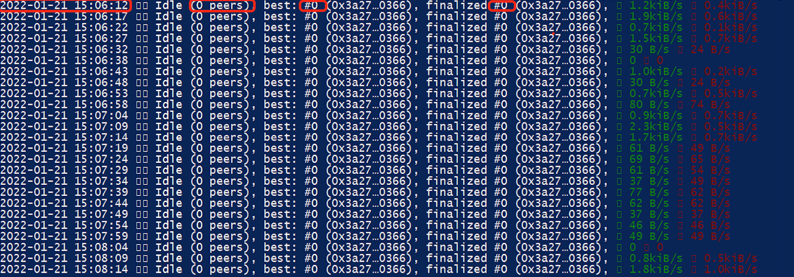

# Ubuntu

* Execute `ps -e | grep cell` command to check if cell miner stars normally.


* Execute `tail -f cell.log` to check if  cell miner is running properly.


There will be 4 part on log:
1. Log output timestamp, output a log every 5 seconds
2. Current number of connected synchronizable nodes, normal synchronization is greater than 0
3. Current block height of public chain
4. Current node synchronized block height


# windows

**You can't start** cell.exe by **double-clicking, you must start the mining program through CMD or Shell command console**, the specific steps are as follows:
* Right-click on a blank space in the folder where the mining program is located, left-click on the pop-up menu and select the "Open powershell window here" option.

* Enter the mining command in the Power Shell window to start mining, the command is as follows:
```
.\cell-win.exe --miner 
0xb7a9fc8fa913b1d6ee5e72b099498bc66d07a0d95029e773d6a12a66c3213067 --rpc-cors=all --unsafe-rpc-external --unsafe-ws-external --pruning archive
```

Note: 
**Replace the red part of the above command with your own secret seed, 
.\cell-win.exe to match the full name of the mining program**

* Hit Enter to execute the command to see if the output log in the window is normal, the window can not be closed.


There will be 4 part on log:
1. Log output timestamp, output a log every 5 seconds
2. Current number of connected synchronizable nodes, normal synchronization is greater than 0
3. Current block height of public chain
4. Current node synchronized block height

